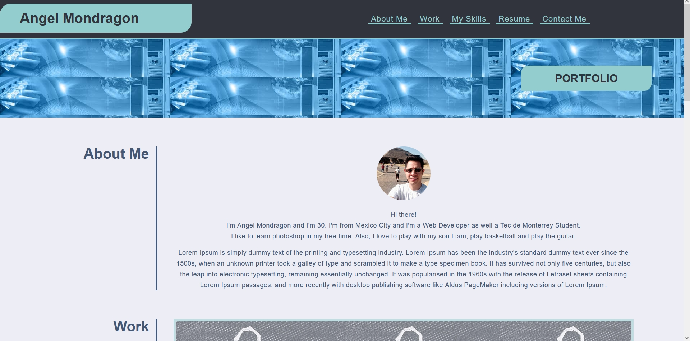
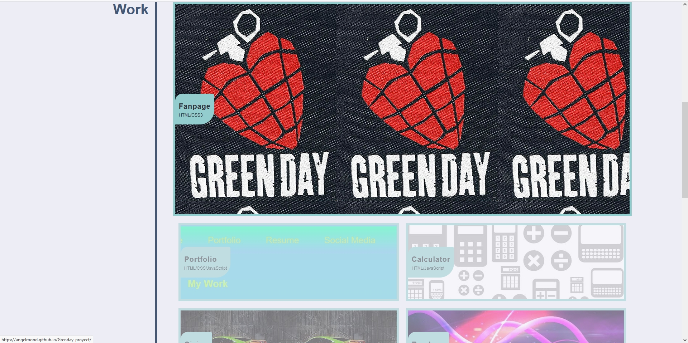
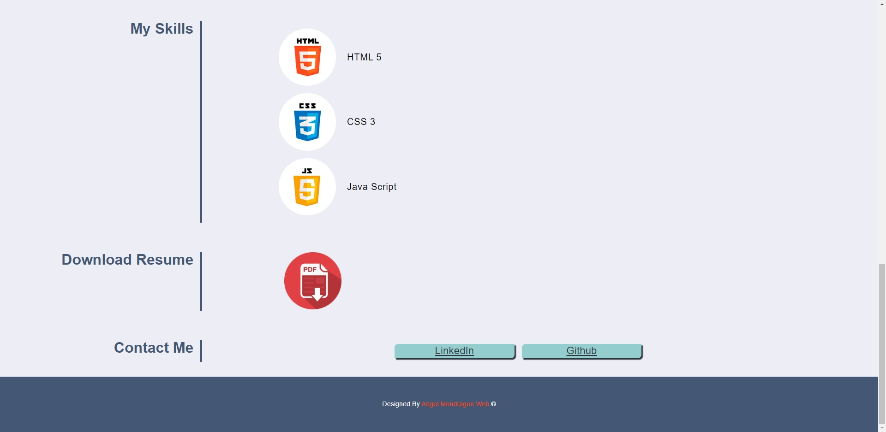
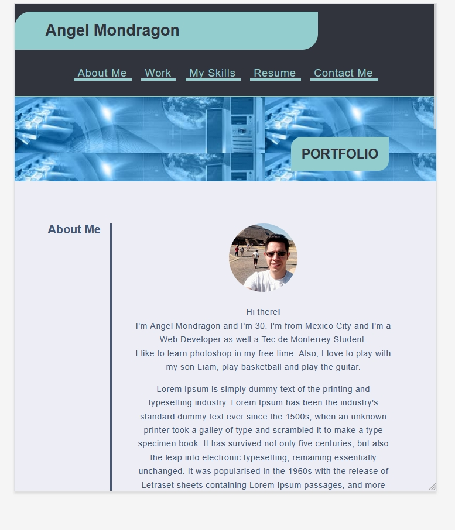
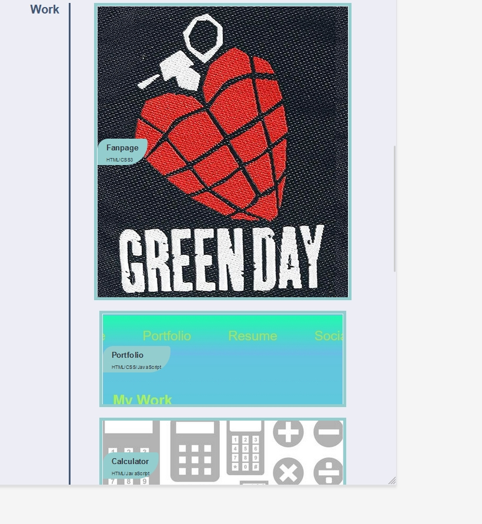
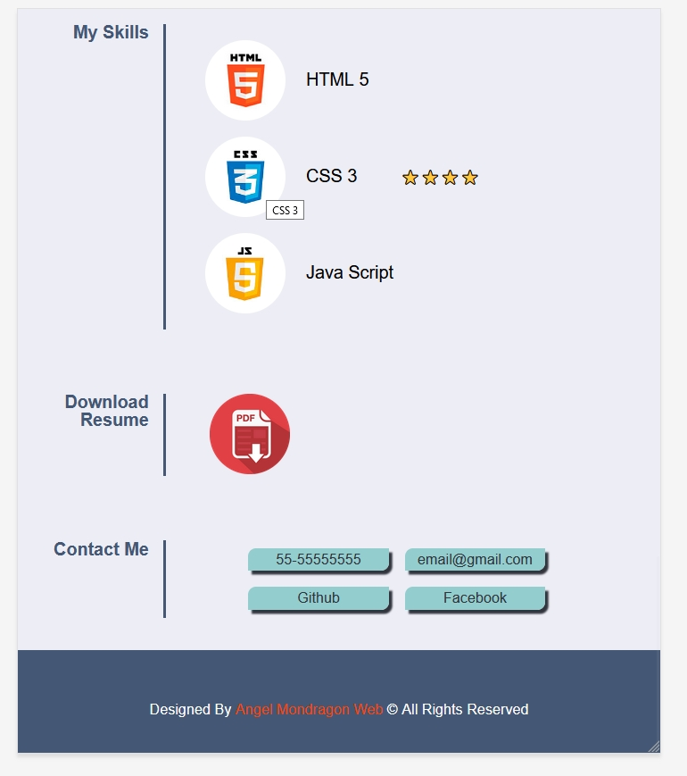
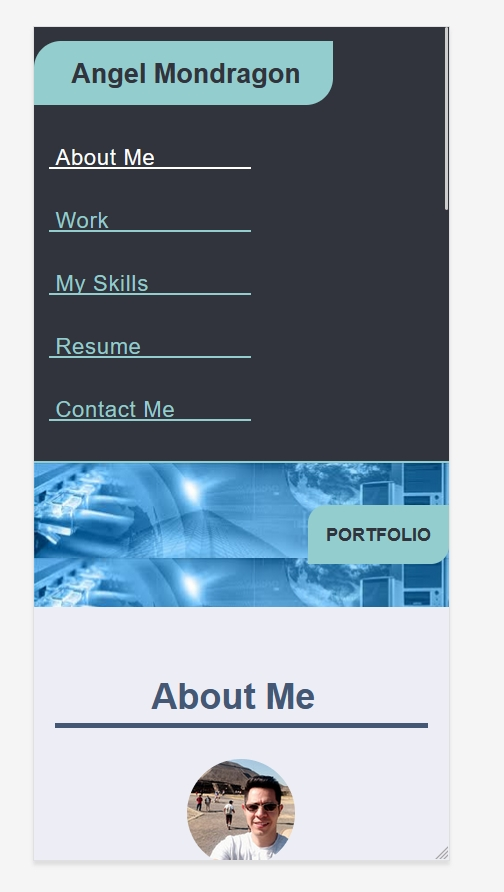
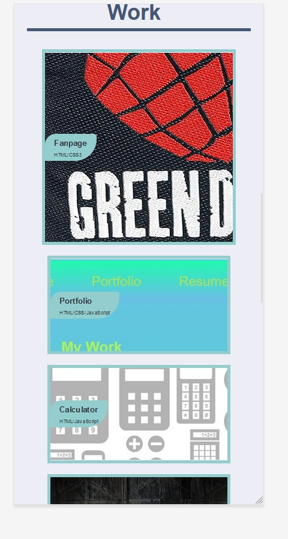
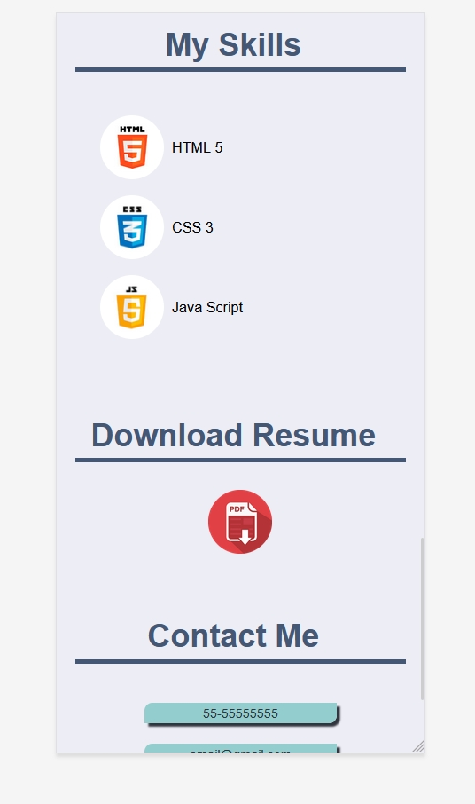
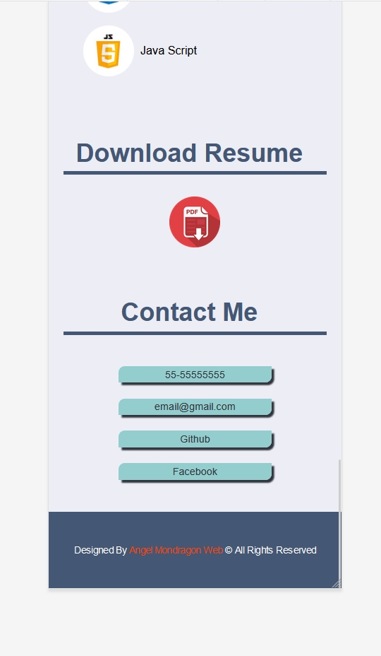

# MY PORTFOLIO

# THIS WEB IS ABOUT MY PORTFOLIO TO SHOW YOU THE PROJECTS I HAVE BEEN WORKING ON. YOU'LL BE ABLE TO SEE THE EXPERIENCE I HAVE USING TECHNOLOGIES SUCH AS HTML, CSS, SASS, BOOTSTRAP, TAILWIND AND JAVASCRIPT.

# ABOUT THIS PROYECT AND TECNOLOGIES

* I created this web using vanilla CSS and HTML.

* I did my best using the correct semantics for the HTML
to have a good SEO.

* I added properly comments for both HTML and CSS.

* Clean code.

* I used Flexbox along the structure of the web to have a good responsive desing.

* Responsive for Large, Medium and Small screen sizes.

# SCREEN SHOTS 

# LARGE SCREENS

<!-- # MEDIUM SCREENS 

# SMALL SCREENS

 -->

# LINK TO THE WEB
https://angelmond.github.io/Cool-Portfolio/
