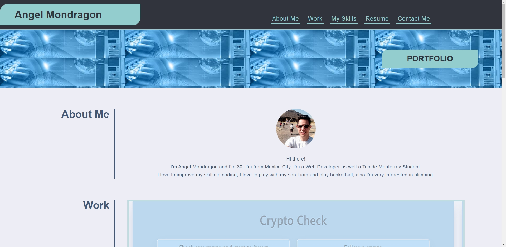

# MY PORTFOLIO

# This project is about my portfolio where you'll be able to see the experience I already have working on several project and using technologies such as JavaScript, HTML, CSS, SASS, Bootstrap, Express, MySQL and Sequelize.

# Technologies used in my portfolio
<!--HTML-->

<!--CSS-->

* I created this web using HTML and vanilla CSS.

* I did my best using the correct semantics for the HTML
to have a good SEO.

* I added properly comments for both HTML and CSS.

* Clean code.

* I used Flexbox along the structure of the web to have a good responsive desing.

* Responsive for Large, Medium and Small screen sizes.

# Screen Shots

# LINK TO THE WEB
https://angelmond.github.io/Portfolio/
