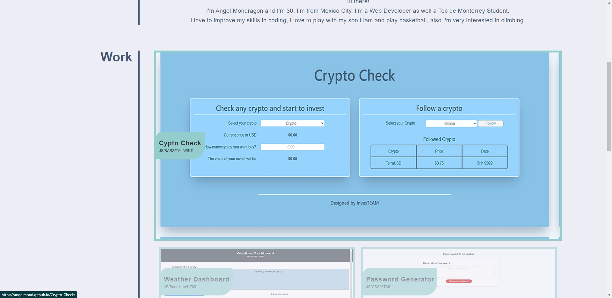
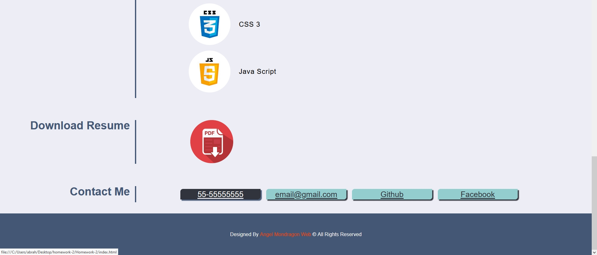

# PORTFOLIO

# THIS WEB IS ABOUT MY PORTFOLIO TO STORE SOME OF MY PROYECTS AND TO HAVE MORE EXPERIENCE IN HTML AND CSS, THIS WEB IS A RECREATION FROM THE MOCK UP PROVIDED BY TRILOGY EDUCATION SERVICES

# ABOUT THIS PROYECT AND TECNOLOGIES

* I create this web only using HTML and CSS.

* I did my best using the correct semantics for the HTML
to have a good SEO.

* I added properly comments for both HTML and CSS.

* Clean code.

* I only used Flexbox along the structure of the web to have a good responsive desing.

* Responsive for Large, Medium and Small screen sizes.

# SCREEN SHOTS 

# LARGE SCREENS

# MEDIUM SCREENS 

# SMALL SCREENS

# LINK TO THE WEB
https://angelmond.github.io/Cool-Portfolio/
